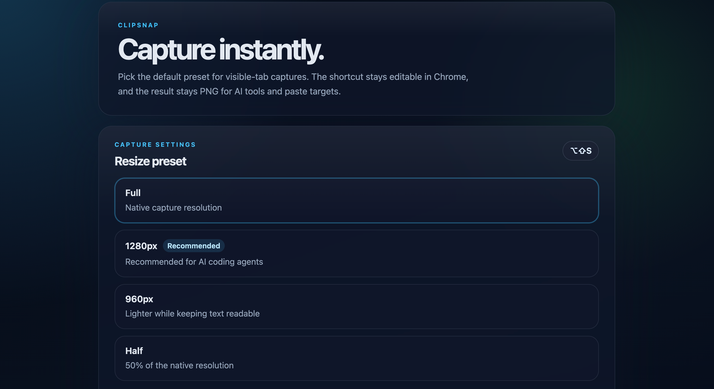

# ClipSnap

ClipSnap captures the visible tab and copies a resized PNG to your clipboard instantly.

Built for developer and power-user workflows, it makes it easy to paste a clean screenshot into AI tools, chat apps, or email without extra steps.

## Screenshot



## Highlights

- One-click capture from the toolbar icon
- Keyboard shortcut: `Alt+Shift+S`
- Automatic resize presets for cleaner pastes
- Works directly in Chrome with no build step

## Status

ClipSnap is not on the Chrome Web Store yet.

You can install it manually in Chrome using Developer Mode.

ClipSnap is released under the MIT License.

## Installation

1. Clone or download this repository to your machine.
2. Open Chrome and go to `chrome://extensions`.
3. Turn on **Developer mode** in the top-right corner.
4. Click **Load unpacked**.
5. Select the ClipSnap project folder.
6. Pin ClipSnap to your toolbar if you want quick access.

## Usage

- Click the ClipSnap toolbar icon to capture the current visible tab.
- Or press `Alt+Shift+S`.
- The screenshot is copied to the clipboard as PNG.

## Customization

Open the extension options page to change the default resize preset.

Available presets:

- `Full`
- `1280px`
- `960px`
- `Half`

## Development

No install step is required for normal use, but you can run the test suite locally with:

```bash
npm test
```

## Notes

- ClipSnap captures the visible area of the active tab only.
- Chrome internal pages such as `chrome://` and `chrome-extension://` pages are restricted by the browser.
- The default resize preset is `1280px`.
